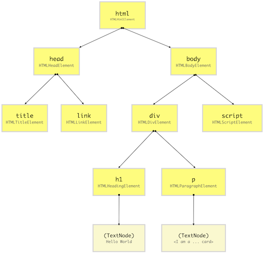
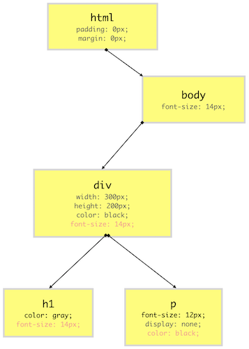
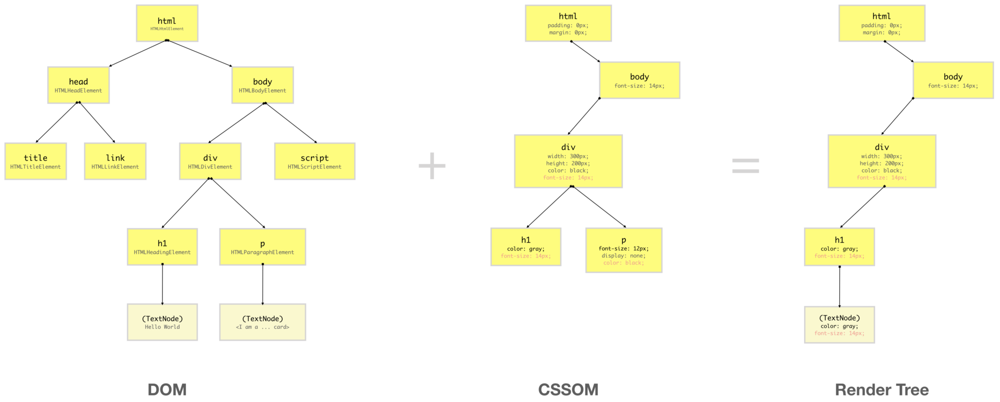

# DOM, CSSOM, Render Tree

> - created by 허재혁(jack2ee)
> - created at 20210422
> - finalized at 20210429

## 1. Document Object Model(DOM)

브라우저가 HTML 코드를 읽을 때, 브라우저는 [Node](https://developer.mozilla.org/en-US/docs/Web/API/Node) 라 불리는 JS 객체를 생성한다.
결국, 모든 HTML 요소는 JS 객체로 변환된다.

모든 HTML 요소가 각기 다른 property 들을 가지고 있으므로, Node 객체는 다른 클래스(생성자 함수)로 생성된다.
예를 들어 `div` 요소를 위한 Node 객체는 `Node` 클래스를 상속한 `HTMLDivElement`로부터 생성된다.
브라우저는 `HTMLDivElement`, `HTMLScriptElement`, `Node` 등을 포함한 내장 클래스를 가지고 있다.

HTML document 로부터 노드들을 생성한 후, 브라우저는 노드 객체의 tree 구조를 생성한다.
HTML 요소들은 서로 중첩되어 있기에, 브라우저는 전에 생성한 노드 객체를 이용하여 요소를 재생산한다.
이는 브라우저가 전 라이프사이클에서 효율적으로 웹 사이트를 렌더링하고 관리할 수 있도록 도와준다.

HTML document를 위한 DOM tree는 위에서 보는 바와 같다.
DOM tree는 가장 위에 있는 `html`에서 시작하여 아래로 내려온다.
HTML 요소를 발견할 때마다 DOM tree는 각각의 클래스(생성자 함수)를 통해 DOM 노드 객체를 생성한다.

JS는 DOM이 무엇인지 이해하지 못한다. DOM을 이해하는 것은 JS의 역할이 아니다.
DOM은 웹 페이지를 효율적으로 렌더링하고 다양한 목적에 맞게 DOM 요소를 개발자가 역동적으로 조작하기 수월하게 하고자 브라우저가 제공하는 high-level의 Web API다.

## 2. CSS Object Model(CSSOM)

DOM을 구성하고 난 후, 브라우저는 모든 소스로부터 CSS를 읽어오고 CSSOM을 구성한다.
CSSOM은 DOM과 같이 tree 구조의 **CSS Object Model** 을 의미한다.

이 트리에 있는 각각의 노드는 선택자에 의해 구체화된 타켓 DOM 요소에 적용될 CSS 스타일 정보를 포함한다.
그러나 CSSOM은 `<meta>`, `<script>`, `<title>`과 같이 스크린에 표현되지 않는 DOM 요소를 포함하지는 않는다.

대부분의 브라우저들은 **user agent stylesheet**라 불리는 각각의 스타일시트를 적용하고 개발자가 적용한 property들로 구성된 CSS 스타일을
기존 user agent style에 overriding 하여(_스타일 적용의 명시성 원칙_) 최종 DOM 요소의 CSS property를 계산하고 노드를 구성한다.

특정 HTML 요소에 대해 `display`같은 CSS property가 정의되지 않았더라도, 그 값은 [W3C CSS](https://www.w3.org/Style/CSS/) 표준에 의해 특정 기본 값으로 설정된다.
CSS property의 기본값을 선정하는 동안, [W3C documentation](https://www.w3.org/TR/CSS1/#inheritance) **상송**의 몇 가지 룰이 적용된다.

예를 들어, 다른 요소들 중 `color`와 `font-size`는 이 속성들이 해당 HTML 요소에 명시되지 않았을 때 부모의 값을 상속받는다.
이는 종속형 스타일(**cascading of styles**)이라 불리고 CSS가 **Cascading Style Sheet**을 의미하는 이유이다.
이것이 브라우저가 CSS cascading 룰에 기초하여 스타일을 계산하기 위한 트리 구조의 CSSOM을 구성하는 이유이다.

아래의 다이어그램을 이용하여 CSSOM tree를 시각화할 수 있다.
간단한 설명을 위해 user-agent styles을 무시하였다.

위의 다이어그램을 통해 알 수 있듯이, CSSOM tree는 `<link>`, `<title>`, `<script>` 등 스크린에 표현되지 않는 요소는 포함하지 않는다.
빨간 색으로 표시된 CSS 속성 값은 속성 값이 상속된 값을 `gray`로 overriding 하기 전까지 위에서부터 상속받는다.

## 3. Render Tree

Render-Tree는 DOM tree와 CSSOM tree를 결함하여 구조화된 tree 구조다.
브라우저는 각각 눈에 보이는 요소의 **layout**을 계산하고 그것을 화면에 **paint** 해야 한다. 이를 위해 브라우저는 Render-Tree를 이용한다.
그러므로, Render-Tree가 구성되지 않으면, 아무것도 화면에 표현되지 않기 때문에 DOM과 CSSOM을 구성하는 이유다.

Render-Tree는 화면에 표현된 것들의 low-level의 표현방식이고 어떤 픽샐도 갖지 않는 노드는 포함하지 않는다.
예를 들어, `display: none;`이 부여된 요소는 `0px(width) * 0px(width)`의 차원을 가지므로, Render-Tree에는 포함되지 않는다.

위의 다이어그램에서 볼 수 있듯이, Render-Tree는 DOM과 CSSOM을 결합한 트리 구조를 생성하며 화면에 표현된 요소들만을 포함한다.

CSSOM 안에서, `p` 요소는 `display:none;` 스타일을 갖는 `div`안에 있기 때문에 스크린 상에서 어떤 공간도 점유하지 않으므로 그것과 자손은 Render-Tree에 포함되지 않는다.
하지만 만약 `visibility:hidden` 혹은 `opacity:0`으로 설정하였다면 스크린 상에서 공간을 점유하므로 Render-Tree 상에 존재한다.

DOM API가 브라우저에 의해 구성된 DOM tree 상에 DOM 요소에 접근할 수 있는 것과 달리, 사용자는 CSSOM에 접근할 수 없다.
그러나 브라우저가 Render Tree를 구성하기 휘애 DOM과 CSSOM을 결합하였기 때문에, DOM API에 제공된 CSSOM을 노출시켜 사용자는 CSSOM 노드의 CSS property에 접근하고 수정할 수 있다.

## References

- [How the browser renders a web page? - DOM, CSSOM, and Rendering](https://medium.com/jspoint/how-the-browser-renders-a-web-page-dom-cssom-and-rendering-df10531c9969) by _Uday Hiwarale_
